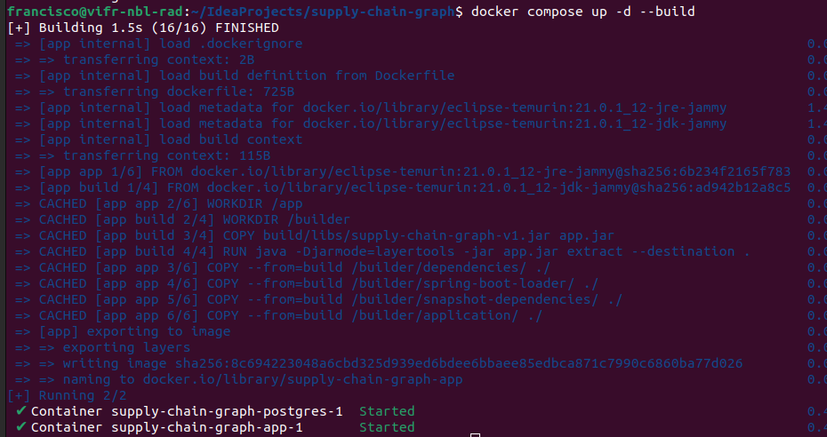
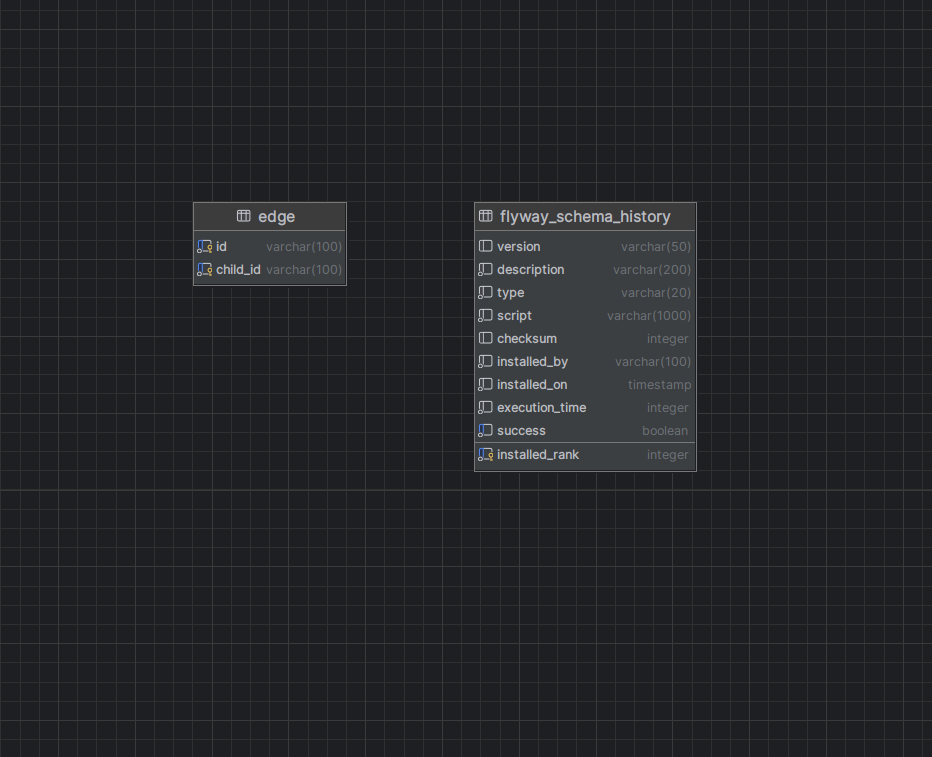

# Supply Chain Graph

## The application
This project involves the development of a backend service using Spring Boot 
with Kotlin to handle a tree data structure. The tree will be represented 
as a set of edges, where each edge connects two nodes, enabling a flexible 
and efficient structure for representing hierarchical data.

### Key Functionalities:
Edge Management:

* Ability to add new edges to the tree.
* Support for deleting existing edges.

Tree Retrieval:
* Retrieve the entire tree structure starting from a specified node.

The service is designed to ensure robustness, scalability, and ease of 
integration.

### Technical Specifications
* Language: Kotlin
* Framework: Spring Boot
* Database: PostgreSQL
* ORM/Database Interaction: JPA with the PostgreSQL database.
* Data Format: JSON for all request and response payloads.

### Notes
* The table columns where changed from from_id to id and from to_id to child_id
for better readability.
* JPA was used to interact with the database.
* Duplicates are not handle since they are considered normal updates.
* When deleting, it does not raise an exception if the edge does not exist. Fire 
and forget approach.
* Log added for observability.
* Foreign keys are not considered since the Graph database are better suited
for recursive data. 
* Flyway was used to handle the database migrations.
* Jakarta.validation was used for handling the validation of the data.
* Ids as integers in the database should not be used since this is a 
security breach, and they don't scale well.
* Gradle was use as package manager since it uses cache for better performance.
* Unit tests added however coverage does not reach an optimum of 80%.
* The migration file will insert the data in the structure:

      Node 1
      ├── Node 2
      │   ├── Node 4
      │   └── Node 5
      └── Node 3
      └── Node 6

## How to run

In order to have the application running, you these applications installed
in your computer:
* Docker 
* Docker Compose 
* Java 21

After that, you can run the following command:

```shell
./gradlew build
docker compose up -d --build
```



## The API

The API is a REST API that has the following endpoint:
```
http://localhost:8080/swagger-ui/index.html
```


## The database

The database is a PostgreSQL database that has the following tables:
* edge
* flyway_schema_history

The diagram of the database is as follows:




## Postman Collection
Please refer to the document called [Supply-chain-graph.postman_collection.json](docs/Supply-chain-graph.postman_collection.json)
